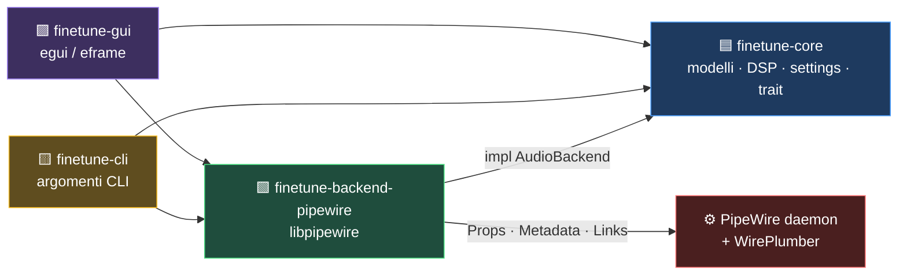

<div align="center">

# FineTune Linux

**Port open-source di [FineTune](https://github.com/ronitsingh10/FineTune) per Linux / PipeWire**

Controllo del volume per singola applicazione, boost fino a 4×, routing multi-dispositivo e equalizzazione a 10 bande — per Linux.

[-3a3a3a?style=flat-square&logo=apple)](https://github.com/ronitsingh10/FineTune)
[](./LICENSE)
[](https://pipewire.org)
[](https://www.rust-lang.org)
[](https://github.com/emilk/egui)

</div>

---

## Indice

- [Cos'è FineTune](#cosè-finetune)
- [Perché esiste questo port](#perché-esiste-questo-port)
- [Stato del progetto](#stato-del-progetto)
- [Funzionalità](#funzionalità)
- [Requisiti](#requisiti)
- [Installazione](#installazione)
- [Compilazione da sorgente](#compilazione-da-sorgente)
- [Uso della CLI](#uso-della-cli)
- [Architettura](#architettura)
- [Come funziona](#come-funziona)
- [Formato dei dati](#formato-dei-dati)
- [AutoEQ](#autoeq)
- [Testing](#testing)
- [Differenze rispetto all'originale macOS](#differenze-rispetto-alloriginale-macos)
- [Roadmap](#roadmap)
- [Contributi](#contributi)
- [Licenza](#licenza)
- [Crediti](#crediti)

---

## Cos'è FineTune

[FineTune](https://github.com/ronitsingh10/FineTune) è un'app gratuita e open-source per macOS che permette di controllare il volume **di ogni singola applicazione** indipendentemente, con:

- **Volume per-app** — slider e mute individuali per ogni programma
- **Boost** — amplifica le app silenziose fino a **4×**
- **Routing multi-dispositivo** — manda una singola app a uno o più speaker/headphone
- **EQ a 10 bande** — 20 preset integrati e preset personalizzabili
- **AutoEQ** — correzione della risposta in frequenza delle cuffie

Sulla macOS FineTune intercetta l'audio con **Screen & System Audio Recording** (CoreAudio Tap). Su Linux non esiste un'equivalente: questo progetto ricostruisce le stesse funzionalità usando le API native di **PipeWire**.

---

## Perché esiste questo port

L'originale è un'app **solo macOS** (Swift + SwiftUI + CoreAudio). Non esiste un equivalente nativo su Linux per il controllo del volume per-app con boost: `pavucontrol` non permette il boost, e la maggior parte dei mixer Linux non supporta il routing multi-app verso più sink contemporaneamente.

Questo repository è un **riporting completo in Rust** dell'architettura di FineTune, riadattata al modello audio di Linux:

| Concetto macOS | Contropartita Linux |
|---|---|
| CoreAudio Tap / AudioDeviceIOProc | Proprietà dei nodi PipeWire (`channelVolumes`, `mute`) |
| Scala volume CoreAudio (cubica) | Scala WirePlumber `module-mixer-api` (cubica) |
| `AudioUnit` / `AVAudioEngine` DSP in-process | Parametri `Props` del nodo + DSP pronto per il filter graph |
| Menu bar (NSStatusItem) | Finestra popup `egui` + tray (da implementare) |
| `Bundle ID` come identità app | `readlink /proc/<pid>/exe` + `application.name` |
| `UserDefaults` / `Application Support` | XDG (`$XDG_DATA_HOME/finetune`, `~/.config/finetune`) |

---

## Stato del progetto

> ⚠️ **Il port è funzionante ma incompleto.** Leggi questa sezione prima di assumere che tutto sia pronto.

| Area | Stato | Note |
|---|:---:|---|
| Backend PipeWire (enum, volume, mute, boost) | ✅ Funzionante | Test live dietro `FT_LIVE=1` |
| Volume per-app + boost 4× | ✅ Funzionante | Scrittura su `channelVolumes` |
| Routing per-app (single/multi sink) | ✅ Funzionante | Via `pactl` + link manuali |
| Impostazione default sink/source | ✅ Funzionante | Metadata `default` |
| Persistenza impostazioni (schema v12) | ✅ Funzionante | Salvataggio atomico + backup |
| GUI egui/eframe | ✅ Funzionante | Finestra popup completa |
| EQ a 10 bande (GUI + persistenza) | ⚠️ Parziale | Le impostazioni si salvano, **ma il DSP non è ancora collegato al backend** |
| AutoEQ (parser/fetcher/ricerca) | ⚠️ Parziale | La libreria è completa e testata, **non è ancora esposta nella GUI** |
| Menu bar / tray icon | ❌ Non fatto | Al posto: finestra popup |
| Media keys / HUD / global hotkey | ❌ Non fatto | Lo schema dei settings è pronto (v12) |
| Loudness compensation (ISO 226) | ❌ Non fatto | Flag presente, logica assente |
| Bluetooth management, DDC, alert volume | ❌ Non fatto | Non applicabile o fuori scope |

**Cosa significa "parziale" per l'EQ:** il pannello EQ della GUI permette di scegliere preset e muovere i 10 slider, e tutto viene persistito correttamente. Tuttavia i coefficienti biquad calcolati da `finetune-core::dsp` non vengono ancora inviati al grafo PipeWire. La GUI lo dichiara esplicitamente: *"Impostazioni EQ salvate per questa app (DSP in fase di porting)"*. La matematica DSP (biquad, EQ, AutoEQ, soft limiter, rampa di gain) è **completamente implementata e testata** in `finetune-core` — manca solo il cablaggio al backend.

---

## Funzionalità

### 🎚 Controllo del volume

- **Volume per-app** — slider e mute per ogni applicazione che riproduce audio
- **Boost 1× / 2× / 3× / 4×** — cicla il guadagno lineare del nodo stream
- **Volume per dispositivo** — controllo indipendente di sink e sorgente
- **Unmute automatico** — alzare il volume di un'app muta la riporta in ascolto
- **Percentuale editabile** — click sul valore numerico per digitare la percentuale esatta
- **Scroll-wheel** — hover su uno slider e rotella del mouse per regolare

### 🔀 Routing audio

- **Routing singolo** — ogni app verso un sink specifico
- **Routing multi-dispositivo** — la stessa app verso più sink contemporaneamente
- **System Audio** — l'app segue il dispositivo di default di sistema
- **Priorità dispositivi** — riordina con le frecce quale dispositivo diventa default
- **Nascondi dispositivi** — nasconde device che non usi
- **Default sink/source** — tap su una riga per impostarla come predefinita

### 🎛 Equalizzatore

- **EQ grafica a 10 bande** — frequenze ISO 1/1-ottava: 31.25 Hz → 16 kHz, range ±12 dB
- **20 preset in 5 categorie** — Utility, Speech, Listening, Music, Media
- **Preset personalizzati** — salva e gestisci le tue curve
- **AutoEQ** — parser completo per profili cuffie EqualizerAPO

### 🖥 Dispositivi

- **Tab Output / Input** — separati, con gestione distinta
- **VU meter** — 8 barre con scala logaritmica (soglie da −40 dB a 0 dB)
- **Badge applicazione** — icona con l'iniziale dell'app
- **Tema chiaro/scuro** — segue il sistema o forzato

---

## Requisiti

### Runtime

- **Linux** con **PipeWire ≥ 0.3.65** come server audio
- **WirePlumber** come session manager (per la scala mixer cubica e i default)
- **Window system**: Wayland (con `xdg-shell`) o X11
- Per la GUI: driver OpenGL o software rendering (`llvmpipe`)

> Nota: pipewire-pulse non è strettamente necessario, ma `pactl` viene usato come percorso preferito per il routing.

### Build

- **Rust ≥ 1.75** (edition 2021) — testato con 1.98
- `pkg-config`
- `clang` (richiesto da `bindgen` per `pipewire-sys`)
- Librerie di sviluppo PipeWire
- Per la GUI: librerie di sviluppo **GTK 3** (richieste da `eframe`)

### Distribuzioni supportate

Testato su Arch Linux. Su Debian/Ubuntu/Fedora i nomi dei pacchetti sono indicati nella sezione [Installazione](#installazione).

---

## Installazione

### 1. Dipendenze di sistema

**Arch Linux**

```bash
sudo pacman -S --needed \
  base-devel clang pkgconf \
  pipewire pipewire-audio wireplumber \
  gtk3
```

**Debian / Ubuntu**

```bash
sudo apt install \
  build-essential clang pkg-config \
  libpipewire-0.3-dev libspa-0.2-dev \
  libgtk-3-dev
```

**Fedora**

```bash
sudo dnf install \
  gcc clang-devel pkgconf-pkg-config \
  pipewire-devel wireplumber \
  gtk3-devel
```

### 2. Verifica che PipeWire è attivo

```bash
pactl info
```

Se `pactl` risponde con informazioni sul server, l'ambiente è pronto.

### 3. Compila e installa

```bash
git clone https://github.com/<tuo-username>/FineTune-Linux.git
cd FineTune-Linux

cargo build --release            # compila tutto il workspace
sudo install -Dm755 target/release/finetune-gui /usr/local/bin/finetune-gui
sudo install -Dm755 target/release/finetune-cli /usr/local/bin/finetune-cli
```

### 4. Avvia

```bash
finetune-gui
```

### Installazione tramite pacchetto

Non è ancora disponibile un pacchetto `.deb` / `.rpm` / Flatpak. Per ora usa la compilazione da sorgente.

> **Nota su Flatpak / sandbox:** il backend PipeWire richiede accesso al socket di PipeWire e al filesystem `/proc`. FineTune **non funziona** dentro Flatpak o Snap senza concessioni specifiche. Usa il binario nativo o un pacchetto di sistema.

---

## Compilazione da sorgente

```bash
# workspace completo (GUI + CLI + librerie)
cargo build --release

# solo la CLI (più leggera, nessuna dipendenza GUI)
cargo build --release -p finetune-cli

# solo la GUI
cargo build --release -p finetune-gui
```

### Ottimizzazioni di rilascio

Il profilo `release` è già configurato per le massime prestazioni:

```toml
[profile.release]
lto = true
codegen-units = 1
opt-level = 3
```

### Compilazione offline

Il repository può essere compilato senza accesso a crates.io se hai una cache locale:

```bash
CARGO_HOME=/percorso/alla/cache cargo build --release --offline
```

### Cross-compilazione

Non supportata ufficialmente. Il backend richiede legatura dinamica a `libpipewire-0.3`.

---

## Uso della CLI

`finetune-cli` espone il backend PipeWire senza la GUI. Utile per script, keybind e debug.

```bash
finetune-cli <comando> [argomenti]
```

### Comandi disponibili

| Comando | Descrizione |
|---|---|
| `list-sinks` | Elenca i dispositivi di uscita |
| `list-inputs` | Elenca i dispositivi di ingresso (microfoni) |
| `list-streams` | Elenca gli stream audio attivi |
| `set-volume <id> <0.0-1.0>` | Imposta il volume di un sink |
| `set-mute <id> <true\|false>` | Imposta il mute di un sink |
| `set-input-volume <id> <0.0-1.0>` | Imposta il volume di un ingresso |
| `set-input-mute <id> <true\|false>` | Imposta il mute di un ingresso |
| `set-stream-volume <id> <0.0-1.0> [boost]` | Volume + boost (1.0–4.0) di uno stream |
| `set-stream-mute <id> <true\|false>` | Mute di uno stream |
| `set-stream-links <id> <sink-id...>` | Ripunta i link di uno stream |
| `set-default <id>` | Imposta il sink di default |
| `set-default-input <id>` | Imposta l'ingresso di default |

### Esempi

```bash
# Vedi tutti i sink disponibili
$ finetune-cli list-sinks
SINK ID  CH     VOL    MUTE        NAME                                             DEFAULT
57       2      0.85   false       Built-in Audio Analog Stereo
64       2      0.60   false       USB Audio Device
71       2      1.00   false       Speakers (JBL)

# Vedi cosa sta suonando
$ finetune-cli list-streams
STREAM ID  PID      VOL    APP                     MEDIA                      LINKS
82        5123     0.42   firefox                 YouTube — Lo-fi beats      [64]

# Abbassa Firefox al 30% con boost 2×
$ finetune-cli set-stream-volume 82 0.30 2.0

# Manda Firefox alle cuffie USB
$ finetune-cli set-stream-links 82 64

# Rendi le cuffie il dispositivo di default
$ finetune-cli set-default 64
```

### Keybind con `sway` / `Hyprland`

```ini
# ~/.config/sway/config
bindsym XF86AudioLowerVolume exec finetune-cli set-stream-volume $(pactl list sink-inputs | grep -m1 'Sink Input #' | cut -d'#' -f2) 0.95
bindsym XF86AudioRaiseVolume exec finetune-cli set-stream-volume $(pactl list sink-inputs | grep -m1 'Sink Input #' | cut -d'#' -f2) 1.05
```

---

## Architettura

Il progetto è un **Cargo workspace** con 4 crate, separati per responsabilità.

```
FineTune-Linux/
├── Cargo.toml                     # workspace + dipendenze condivise
├── finetune-core/                 # 🟦 logica pura, senza dipendenze di sistema
│   └── src/
│       ├── lib.rs
│       ├── models/                #    modelli di dominio
│       │   ├── audio_app.rs           # identità di un'applicazione
│       │   ├── audio_device.rs        # dispositivo portabile (sink/source)
│       │   ├── boost.rs               # livelli 1×–4×
│       │   ├── device_selection_mode.rs  # single / multi routing
│       │   ├── eq_preset.rs           # catalogo 20 preset
│       │   ├── eq_settings.rs         # curve a 10 bande
│       │   ├── transport.rs           # USB, Bluetooth, HDMI, …
│       │   └── volume.rs              # curva percettiva x²
│       ├── dsp/                   #    matematica audio real-time-safe
│       │   ├── biquad_math.rs          # coefficienti RBJ Audio EQ Cookbook
│       │   ├── biquad.rs               # cascata + scambio atomico
│       │   ├── eq_processor.rs         # EQ 10 bande per-app
│       │   ├── autoeq_processor.rs     # correzione AutoEQ
│       │   ├── gain.rs                 # rampa esponenziale + output gate
│       │   └── soft_limiter.rs         # limiter a ginocchio morbido
│       ├── autoeq/                #    pipeline AutoEQ
│       │   ├── profile.rs              # modello profilo + validazione
│       │   ├── parser.rs               # parser ParametricEQ.txt
│       │   ├── search.rs               # ricerca fuzzy 3-tier
│       │   ├── loader.rs               # I/O profili importati
│       │   └── fetcher.rs              # download da GitHub (feature `network`)
│       ├── settings/              #    persistenza schema v12
│       │   ├── settings.rs             # struttura + decoder lenient
│       │   ├── types.rs                # enumi e tipi condivisi
│       │   └── manager.rs              # debounce + scrittura atomica
│       └── backend/
│           └── audio_backend.rs    # ⭐ trait astratto del backend
│
├── finetune-backend-pipewire/    # 🟩 implementazione PipeWire
│   └── src/lib.rs                #    1200 righe, connessione sincrona
│
├── finetune-cli/                 # 🟨 interfaccia a riga di comando
│   └── src/main.rs
│
└── finetune-gui/                 # 🟪 interfaccia grafica egui
    └── src/
        ├── main.rs               #    bootstrap finestra
        ├── app.rs                #    stato + layout principale
        ├── design.rs             #    design token (chiaro/scuro)
        ├── widgets.rs            #    componenti custom
        ├── icons.rs              #    icone vettoriali disegnate
        └── settings.rs           #    persistenza per-app
```

### Il trait `AudioBackend`

Il cuore del port è l'astrazione in `finetune-core/src/backend/audio_backend.rs`. Tutto il resto dell'applicazione dipende solo da questo trait:

```rust
pub trait AudioBackend {
    type Error: std::error::Error + Send + Sync + 'static;

    fn list_sinks(&self)   -> Result<Vec<AudioSink>,   Self::Error>;
    fn list_inputs(&self)  -> Result<Vec<AudioInput>,  Self::Error>;
    fn list_streams(&self) -> Result<Vec<AudioStream>, Self::Error>;

    fn set_sink_volume(&self, id: &str, volume: f32) -> Result<(), Self::Error>;
    fn set_sink_mute(&self, id: &str, muted: bool) -> Result<(), Self::Error>;
    fn set_input_volume(&self, id: &str, volume: f32) -> Result<(), Self::Error>;
    fn set_input_mute(&self, id: &str, muted: bool) -> Result<(), Self::Error>;

    fn set_stream_volume_with_boost(
        &self, id: &str, volume: f32, boost: f32,
    ) -> Result<(), Self::Error>;
    fn set_stream_mute(&self, id: &str, muted: bool) -> Result<(), Self::Error>;
    fn set_stream_links(&self, id: &str, sink_ids: &[String]) -> Result<(), Self::Error>;

    fn set_default_sink(&self, id: &str) -> Result<(), Self::Error>;
    fn set_default_input(&self, id: &str) -> Result<(), Self::Error>;
}
```

I tipi di dominio (`AudioSink`, `AudioInput`, `AudioStream`) sono condivisi e serializzabili. Aggiungere un backend PulseAudio o ALSA significa implementare questo trait e nulla altro.



---

## Come funziona

### Semantica del volume

Questo è il punto più importante da capire. Il backend segue esattamente la semantica di WirePlumber (`module-mixer-api.c`):

| Concetto | Significato |
|---|---|
| **Valore display** | Radice **cubica** del volume lineare per canale. È il numero che vedi nello slider e che leggi da `wpctl get-volume` |
| **Valore lineare** | Il gain PCM effettivo applicato al segnale |
| **Canale 0** | Il canale di riferimento usato per il round-trip |

```
display = cbrt(linear)          // conversione in lettura
linear = display³               // conversione in scrittura
```

Esempio: slider al 50% → `0.5³ = 0.125` lineare → circa −18 dB.

Con il boost, la scrittura diventa:

```
linear = volume³ × boost        // boost ∈ [1.0, 4.0]
```

Il boost **non** è un valore separato: viene fuso nella stessa scrittura del nodo. Quando il volume è 1.0 e il boost è 3.0, il valore letto indietro supera 1.0 — il backend lo riconosce e lo riporta come `volume=1.0, boost=3.0`.

### Identità di un'applicazione

Su macOS FineTune usa il **Bundle ID**. Su Linux non esiste un equivalente universale, quindi l'identità è risolta con una catena di fallback:

1. **`readlink /proc/<pid>/exe`** → nome del binario (es. `firefox`) — il più stabile, sopravvive al cambio di finestra
2. **`application.name`** di PipeWire (es. `Firefox`) — se `/proc` non è leggibile
3. **`node.name`** o `stream:<id>` — ultimo fallback

Il risultato è la chiave usata in tutte le mappe di persistenza (`app_volumes`, `app_boosts`, …).

### Routing per-app

Il routing è l'operazione più delicata, perché PipeWire non espone un'API nativa per spostare il client di un'applicazione. L'implementazione usa due percorsi:

1. **Percorso preferito — `pactl move-sink-input`**
   Il backend chiama `pactl`, cerca la sink-input corrispondente al nostro stream PipeWire (confrontando PID, `node.name` e `application.name` con un punteggio di confidenza) e la sposta. Il session manager riconosce la mossa, la mantiene e la sincronizza.

2. **Fallback — link manuali**
   Se `pactl` non è disponibile o lo stream non è visibile dal layer PulseAudio, il backend crea direttamente i link tramite `link-factory` con `object.linger=1`, e distrugge quelli non più desiderati. Supporta il routing multi-sink, che `pactl` non sa fare.

### Dispositivi di default

Il default sink/source si legge e scrive nel **metadata oggetto `default`** di PipeWire:

- Chiave `default.audio.sink` / `default.audio.source`
- Tipo `Spa:String:JSON`
- Valore `{"name": "..."}`

### Persistenza

I settings usano uno schema JSON **fedele a macOS (v12)**, così eventuali migrazioni future restano coerenti con l'originale. Il decoder è deliberatamente **lenient**, replicando le regole del decoder Swift:

- Chiavi mancanti → valori di default (mai un errore)
- Volumi fuori scala → clampati a `[0, 1]`
- Boost `NaN`/non finiti → scartati
- Singole voci non decodificabili → scartate, la mappa resta valida

I salvataggi sono **debounced** (500 ms trailing, tetto 2000 ms) e **atomici** (file temporaneo + `fsync` + `rename`). Un file corrotto viene sempre preservato come `settings.backup.json` prima del fallback ai default.

---

## Formato dei dati

### Percorsi

| Dato | Percorso |
|---|---|
| Settings (GUI) | `$XDG_CONFIG_HOME/finetune/settings.json` |
| Settings (libreria) | `$XDG_DATA_HOME/finetune/settings.json` |
| Cache catalogo AutoEQ | `$XDG_DATA_HOME/finetune/autoeq-catalog.json` |
| Profili AutoEQ scaricati | `$XDG_DATA_HOME/finetune/AutoEQ/fetched/` |
| Profili AutoEQ importati | `$XDG_DATA_HOME/finetune/AutoEQ/` |

> La GUI usa `$XDG_CONFIG_HOME/finetune/settings.json`; la libreria `SettingsManager` usa `$XDG_DATA_HOME/finetune/settings.json`. Sono due implementazioni parallele — vedi [Differenze rispetto all'originale macOS](#differenze-rispetto-alloriginale-macos).

### Struttura dei settings (schema v12)

```jsonc
{
  "version": 12,

  // Stato per-app, chiavi = identità applicazione
  "appVolumes":               { "firefox": 0.42 },
  "appBoosts":                { "firefox": 2.0 },
  "appMutes":                 { "steam": true },
  "appDeviceRouting":         { "firefox": "64" },
  "appSelectedDeviceUIDs":    { "spotify": ["64", "71"] },
  "appDeviceSelectionMode":   { "spotify": "multi" },
  "appEQSettings":            { "firefox": { "bandGains": [6,6,5,-1,0,0,0,0,0,0], "is_enabled": true } },

  // Dispositivi
  "outputDevicePriority":     ["71", "64", "57"],
  "inputDevicePriority":      [],
  "hiddenOutputDeviceUIDs":   ["alias-output-1"],
  "hiddenInputDeviceUIDs":    [],

  // AutoEQ
  "deviceAutoEQ":             { "64": { "profile_id": "hd600", "is_enabled": true } },
  "favoriteAutoEQProfiles":   ["hd600", "sony-wh-1000xm4"],
  "autoEQPreampEnabled":      true,

  // Preferenze
  "pinnedApps":               [],
  "ignoredApps":              [],
  "userEQPresets":            [],
  "systemSoundsFollowsDefault": true,
  "appSettings": {
    "launch_at_login": false,
    "appearance": "system",
    "popup_size": "comfortable",
    "default_new_app_volume": 1.0,
    "hud_style": "tahoe",
    "volume_hotkey_step": "normal",
    "media_key_control_enabled": true,
    "custom_shortcuts": {}
  }
}
```

### Preset EQ integrati

20 preset in 5 categorie, con i valori esatti dell'app originale:

| Categoria | Preset |
|---|---|
| **Utility** | Flat · Bass Boost · Bass Cut · Treble Boost |
| **Speech** | Vocal Clarity · Podcast · Spoken Word |
| **Listening** | Loudness · Late Night · Small Speakers |
| **Music** | Rock · Pop · Electronic · Jazz · Classical · Hip-Hop · R&B · Deep · Acoustic |
| **Media** | Movie |

---

## AutoEQ

Il modulo AutoEQ è una pipeline completa, riportata da `FineTune/Audio/AutoEQ/`:

### Flusso

```
INDEX.md (GitHub)          ParametricEQ.txt (utente)
        │                            │
        ▼                            ▼
  parse_index_markdown()      AutoEQParser::parse()
  deduplica per priorità              │
  fonte di misurazione                 ▼
        │                      AutoEQProfile
        │                            │
        ▼                            ▼
  AutoEQFetcher ────────────► AutoEQProfileLoader
  (cache 7 giorni)            (importa / esporta)
        │                            │
        └────────────┬───────────────┘
                     ▼
              AutoEQSearch
          (ricerca fuzzy 3-tier)
                     │
                     ▼
              AutoEQProcessor
         (pre-warp → biquad → preamp)
```

### Ricerca fuzzy

Tre livelli di matching, in ordine di rilevanza:

| Tier | Criterio | Punteggio |
|---|---|---|
| 1 | Sottostringa esatta nel nome originale | 100+ (bonus prefisso +50, match esatto +100) |
| 2 | Sottostringa normalizzata (ignora spazi e punteggiatura) | 50+ (bonus prefisso +25) |
| 3 | Match fuzzy per token con distanza di editazione | max 49 |

La distanza di editazione ammette errori fino a 1 carattere per token brevi (≤4) e 2 per token lunghi — così `"senheiser"` trova comunque le Sennheiser.

### Formato `ParametricEQ.txt`

Il parser accetta il formato standard di EqualizerAPO:

```ini
# AutoEq preamp
Preamp: -5.5 dB
Filter 1: ON PK Fc 100 Hz Gain -2.3 dB Q 1.41
Filter 2: ON LSC Fc 105 Hz Gain 7.0 dB Q 0.71
Filter 3: ON HS Fc 8000 Hz Gain 3.0 dB Q 0.707
Filter 4: OFF PK Fc 200 Hz Gain 5.0 dB Q 1.0
```

- `PK` / `PEQ` → peaking · `LS` / `LSC` → low shelf · `HS` / `HSC` → high shelf
- I filtri `OFF` vengono saltati
- Massimo **10 filtri**, preamp clampato a ±30 dB
- Filtri con frequenza ≤ 0, Q ≤ 0 o gain > 30 dB vengono scartati
- Le frequenze vengono **pre-warped** se il profilo è ottimizzato per un sample rate diverso da quello corrente

### Deduplicazione del catalogo

Quando lo stesso modello è misurato da più fonti, vince la fonte con priorità più alta:

`oratory1990` → `crinacle` → `Rtings` → `Innerfidelity` → `Super Review` → `Headphone.com Legacy`

---

## Testing

La suite copre **83 test unitari** in `finetune-core`, tutti verificati e verdi.

```bash
# Tutti i test
cargo test --workspace

# Solo core
cargo test -p finetune-core

# Con output dettagliato
cargo test -p finetune-core -- --nocapture
```

### Cosa viene testato

| Area | Test | Verifica |
|---|---:|---|
| **Soft limiter** | 6 | Soglia, asintoto, preservazione segno, proprietà su 1M campioni |
| **Biquad** | 4 | Identità a gain 0 dB, bypass, mono/stereo, processing |
| **Coefficienti biquad** | 6 | Risposta unitaria, peaking/shelf, pre-warp neutro |
| **EQ processor** | 3 | Piatto = identità, bypass, stabilità con boost |
| **AutoEQ processor** | 5 | Preamp, conteggio filtri, disabilitazione, riapplicazione |
| **Gain ramp** | 4 | Convergenza, time constant, output gate |
| **Volume** | 4 | Curva x², roundtrip, tier software vs hardware |
| **Settings** | 18 | Clamping, NaN, backup file, debounce, collisioni nomi, pruning |
| **AutoEQ** | 21 | Parsing, deduplicazione, codifica URL, ricerca fuzzy, import |
| **Modelli** | 10 | Preset validi, boost, trasporto, selezione device |
| **Backend live** | 2 | Roundtrip volume/mute e creazione/distruzione link |

### Test live (richiedono PipeWire attivo)

Due test del backend interagiscono con il sistema audio reale e sono **saltati per default**. Per eseguirli:

```bash
FT_LIVE=1 cargo test -p finetune-backend-pipewire -- --ignored --nocapture
```

> ⚠️ Questi test **modificano il volume** dei tuoi dispositivi reali. Assicurati di aver scelto un dispositivo di prova.

---

## Differenze rispetto all'originale macOS

Questa sezione documenta onestamente dove il port diverge dall'originale.

### Non implementato

| Funzionalità | Stato | Motivo |
|---|:---:|---|
| Menu bar / tray | ❌ | La finestra popup è l'equivalente funzionale |
| Global hotkeys | ❌ | Richiede `xkbcommon` + grabbing Wayland |
| Media keys F10–F12 | ❌ | Stesso motivo |
| Volume HUD | ❌ | Lo stile è nello schema, il rendering no |
| Loudness compensation | ❌ | Le curve ISO 226:2023 non sono state portate |
| Bluetooth management | ❌ | Richiede `bluetoothd` D-Bus |
| DDC/CI (monitor via DisplayPort) | ❌ | Richiede I²C, fuori scope |
| Alert volume | ❌ | Non esiste un concetto equivalente in PipeWire |
| URL scheme `finetune://` | ❌ | Sostituito dalla CLI |

### Implementato in modo diverso

| Aspetto | macOS | Linux |
|---|---|---|
| Intercettazione audio | CoreAudio Tap (processo in ascolto) | Proprietà dei nodi PipeWire |
| Identità app | Bundle ID | `/proc/<pid>/exe` → `application.name` |
| Persistenza settings | `Application Support` (v12) | `$XDG_DATA_HOME/finetune` (schema v12) |
| Volumi per-app | CoreAudio volume scalare | `channelVolumes` cubico per canale |
| Routing multi-device | CoreAudio aggregate device | Link manuali `object.linger` |
| Default device | `AudioObject` system default | Metadata `default` |
| Auto-selezione app in ascolto | `AudioHardware` tap priority | Ordine per `node.id` |
| Startup al login | `SMAppService` | ❌ non fatto |

### Due implementazioni dei settings

Il workspace contiene **due** sistemi di persistenza che coesistono:

1. **`finetune-core::settings::SettingsManager`** — port fedele di `SettingsManager.swift`, schema v12, con debounce, scrittura atomica, backup, pruning, AutoEQ, preset utente, shortcut. Scrive in `$XDG_DATA_HOME/finetune/settings.json`. **Non è ancora usato dalla GUI.**

2. **`finetune_gui::settings::SettingsStore`** — implementazione più semplice usata dalla GUI corrente, scrive in `$XDG_CONFIG_HOME/finetune/settings.json`.

La GUI è quindi su un percorso di settings leggermente divergente. Unificarli è nel [roadmap](#roadmap).

---

## Roadmap

Priorità suggerite per lo sviluppo futuro:

### Fase 1 — Completare l'audio
- [ ] **Collegare il DSP al backend PipeWire** — creare un filter graph per-app (`filter-factory`) e inviare i coefficienti biquad di `finetune-core::dsp` alla catena
- [ ] **Attivare l'EQ in tempo reale** — la GUI già salva le curve, manca solo il percorso dati
- [ ] **AutoEQ end-to-end** — esporre parser, ricerca e fetcher nella GUI con selettore profilo per dispositivo
- [ ] **Soft limiter online** — proteggere dal clipping quando boost > 1×

### Fase 2 — Unificare e ripulire
- [ ] **Unificare i settings** — migrare la GUI su `SettingsManager` di core
- [ ] **Rimuovere il codice morto** — 22 warning `dead_code` nella GUI
- [ ] **Collegare il VU meter** — `VuMeter::update` esiste ma non è mai chiamato
- [ ] **Aggiungere log per il parsing** in parser e loader AutoEQ

### Fase 3 — Integrazione desktop
- [ ] **Tray icon + menu popup** con `libappindicator` o `ksni`
- [ ] **Global hotkeys** via `xkbcommon` (X11) e `wlrctl` (Wayland)
- [ ] **Supporto media keys** con HUD on-screen
- [ ] **Avvio automatico** — `~/.config/autostart/finetune.desktop`

### Fase 4 — Avanzato
- [ ] **Loudness compensation** — curve ISO 226:2023
- [ ] **AutoEQ pre-bundled** — profili comuni inclusi nel binario
- [ ] **Backend PulseAudio** — implementazione alternativa del trait `AudioBackend`
- [ ] **Pacchetti distribuzione** — `.deb`, `.rpm`, Flatpak con concessioni PipeWire

---

## Contributi

I contributi sono benvenuti. Ecco come procedere.

### Sviluppo locale

```bash
# Fork + clone
git clone https://github.com/<tuo-username>/FineTune-Linux.git
cd FineTune-Linux

# Crea un branch
git checkout -b feature/la-tua-feature

# Sviluppa, con verifica
cargo test --workspace
cargo clippy --workspace -- -D warnings
cargo fmt --all

# Commit e push
git add .
git commit -m "feat: descrizione breve"
git push origin feature/la-tua-feature
```

### Linee guida

- **Rispetta la separazione dei crate** — `finetune-core` non deve mai dipendere da PipeWire o da un framework GUI
- **Mantieni RT-safety** — il codice DSP non deve allocare, bloccare mutex o fare I/O nei path audio
- **Aggiungi test** — ogni nuova funzionalità arriva con i suoi test
- **Segui lo stile esistente** — commenti in italiano, nomi in inglese
- **Un commit = un concetto** — messaggi in inglese, descrittivi

### Aree dove il contributo è più prezioso

1. **DSP → PipeWire** — il pezzo più importante mancante
2. **Tray e hotkeys** — integrazione desktop
3. **Loudness compensation** — curve ISO 226
4. **Documentazione** — guide, esempi, troubleshooting

---

## Licenza

```
FineTune Linux
Copyright (C) 2025 FineTune Linux contributors

This program is free software: you can redistribute it and/or modify
it under the terms of the GNU General Public License as published by
the Free Software Foundation, either version 3 of the License, or
(at your option) any later version.

This program is distributed in the hope that it will be useful,
but WITHOUT ANY WARRANTY; without even the implied warranty of
MERCHANTABILITY or FITNESS FOR A PARTICULAR PURPOSE.  See the
GNU General Public License for more details.

You should have received a copy of the GNU General Public License
along with this program.  If not, see <https://www.gnu.org/licenses/>.
```

**GPL-3.0-or-later** — lo stesso dell'originale. Il testo completo della licenza è nel file [`LICENSE`](./LICENSE) (GPL-3.0).

---

## Crediti

### Progetto originale

- **[FineTune](https://github.com/ronitsingh10/FineTune)** di [Ronit Singh](https://github.com/ronitsingh10) — l'app macOS originale, sotto GPL-3.0
- [AutoEq](https://github.com/jaakkopasanen/AutoEq) di Jaakko Pasanen — dataset e profili di misurazione cuffie
- [EqualizerAPO](https://sourceforge.net/projects/equalizerapo/) — formato `ParametricEQ.txt`
- [Audio EQ Cookbook](https://www.w3.org/TR/audio-eq-cookbook/) di Robert Bristow-Johnson — coefficienti biquad
- **oratory1990**, **crinacle**, **Rtings**, **Innerfidelity** — le fonti di misurazione del catalogo AutoEQ

### Tecnologie usate

| Progetto | Ruolo |
|---|---|
| [PipeWire](https://pipewire.org) | Server audio, grafo e parametri |
| [WirePlumber](https://gitlab.freedesktop.org/pipewire/wireplumber) | Session manager, scala mixer, default |
| [libpipewire](https://gitlab.freedesktop.org/pipewire/pipewire) — crate `pipewire` 0.10 | Bindings Rust |
| [egui / eframe](https://github.com/emilk/egui) 0.36 | GUI |
| [serde](https://serde.rs) | Serializzazione JSON |
| [arc-swap](https://github.com/vasi/arc-swap) | Scambio atomico lock-free dei coefficienti |
| [ureq](https://github.com/algesten/ureq) | Client HTTP per AutoEQ |
| [thiserror](https://github.com/brson/thiserror) | Errori derivati |

---

## Licenza e conformità

FineTune Linux è un'opera derivata da [FineTune](https://github.com/ronitsingh10/FineTune), distribuito sotto gli stessi termini di licenza (GPL-3.0-or-later). Questo rispetta la licenza dell'originale.

I profili AutoEQ scaricati provengono da [AutoEq](https://github.com/jaakkopasanen/AutoEq) e sono soggetti alla licenza di quel progetto. I dati di misurazione appartengono ai rispettivi autori (oratory1990, crinacle, Rtings, Innerfidelity).

---

<div align="center">

**FineTune Linux** — il mixer che macOS non ha, per chi lo usa.

<sub>Portato in Rust con ❤️ per la community Linux</sub>

[↑ Torna all'inizio](#finetune-linux)

</div>
